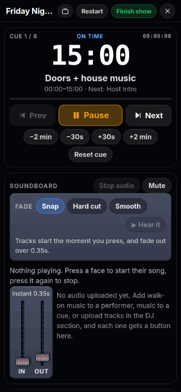
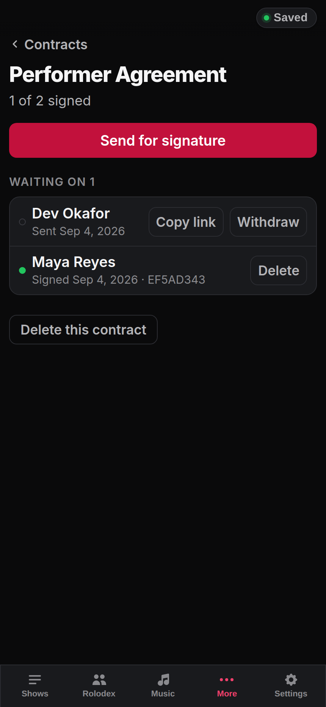
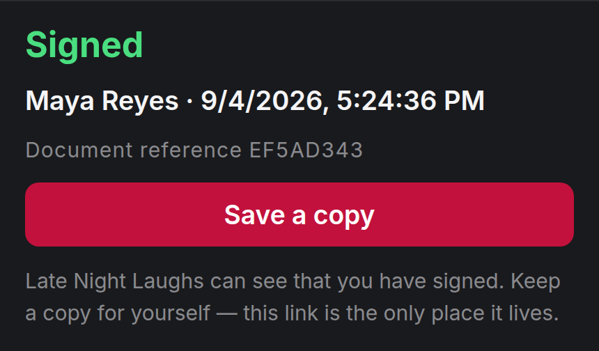
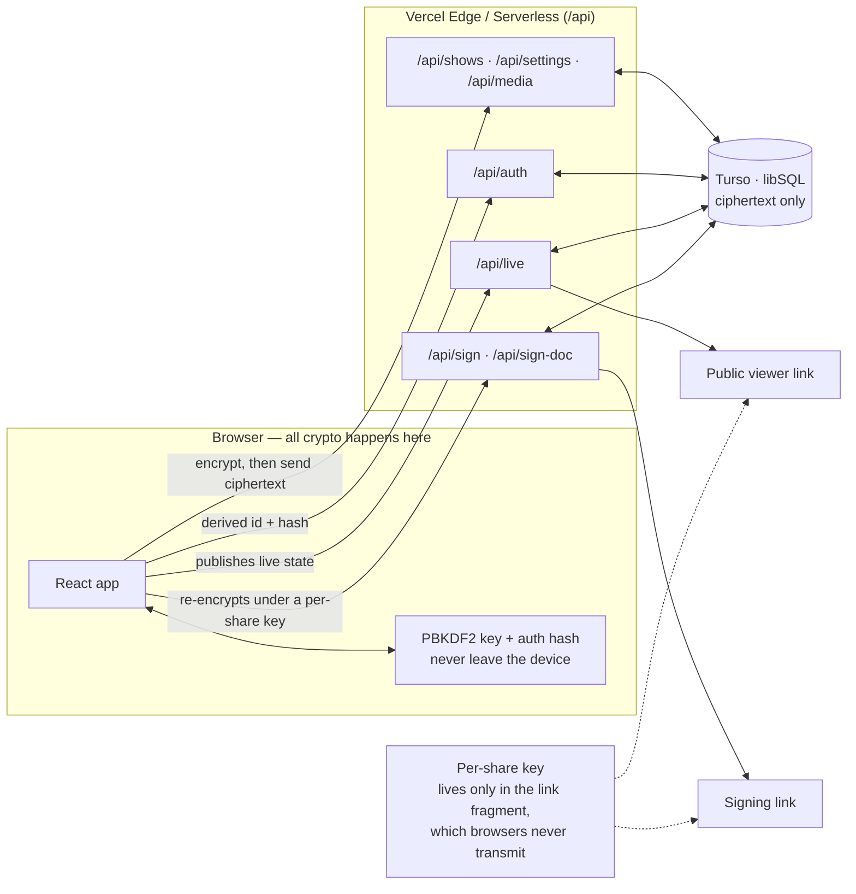

<div align="center">

# I Can Run A Show

**Live-show management for comedians, drag promoters, and variety producers — build the lineup, import the schedule, and run the show.**

[**icanrunashow.com →**](https://icanrunashow.com)

[](https://github.com/taylordrew4u2/Showrunner-ICanRunAShow/actions/workflows/ci.yml)
[](LICENSE)
&nbsp;


</div>

> One tool for the full live-show lifecycle: plan the lineup, attach walk-on music, import a printed schedule by photo, then operate the show in a full-screen live mode with per-cue countdowns — and broadcast the on-stage state to a public viewer link.

## Table of Contents

- [Overview](#overview)
- [Problem](#problem)
- [Solution](#solution)
- [Features](#features)
- [Tech Stack](#tech-stack)
- [Architecture](#architecture)
- [How to Run Locally](#how-to-run-locally)
- [iOS App](#ios-app)
- [Usage](#usage)
- [What I Built](#what-i-built)
- [Technical Decisions](#technical-decisions)
- [Challenges Solved](#challenges-solved)
- [Testing](#testing)
- [Security](#security)
- [Accessibility](#accessibility)
- [Known Limitations](#known-limitations)
- [Roadmap](#roadmap)
- [License](#license)

---

## Screenshots

Try it live at **[icanrunashow.com](https://icanrunashow.com)**. These are generated with `npm run screenshots` (see [docs/screenshots/CAPTURE.md](docs/screenshots/CAPTURE.md)).

<p align="center">
  
</p>
<p align="center">
  <sub><b>Run Show</b> live mode — the cue countdown running, the drift indicator moving from on-time to ahead, and the running order advancing</sub>
</p>

<p align="center">
  
  
  
</p>
<p align="center">
  <sub><b>Shows dashboard</b> — what's next and what still needs doing &nbsp;·&nbsp; <b>Show detail</b> — the section accordion &nbsp;·&nbsp; <b>Run-of-show</b> — build the cue list (or import it from a photo, PDF, or text)</sub>
</p>

<p align="center">
  
  
  
</p>
<p align="center">
  <sub><b>Performer profile</b> — clickable Instagram + email &nbsp;·&nbsp; <b>Rolodex</b> — wording adapts to your show types &nbsp;·&nbsp; <b>Settings</b> — theme, show types &amp; terminology</sub>
</p>

<p align="center">
  
  
  
</p>
<p align="center">
  <sub><b>Run Show</b> — the clock, the soundboard, and the lineup &nbsp;·&nbsp; <b>More</b> — the between-shows pages, off a five-tab bar &nbsp;·&nbsp; <b>Contracts</b> — one signed, one still waiting, each with the hash of the document agreed to</sub>
</p>

<p align="center">
  
  
</p>
<p align="center">
  <sub><b>Stage remote &amp; storage</b> — a paired clicker for running sound from the stage, and the sweep for uploads nothing points at any more &nbsp;·&nbsp; <b>What the signer sees</b> — no account, no app, and a document reference they keep</sub>
</p>

---

## Overview

I Can Run A Show is a production tool for comedians, promoters, and stage managers who run recurring live shows. It covers the full show lifecycle: building a lineup, coordinating staff, importing a schedule from a PDF or photo, and operating the show in a full-screen live mode with cue timing and walk-on music.

The target user is an independent promoter or stage manager who currently uses a mix of spreadsheets, notes apps, and Spotify. I Can Run A Show puts all of that in one place and syncs it across devices.

---

## Problem

Live show coordinators have no dedicated tool that spans pre-show planning and real-time stage management. Building a lineup, attaching walk-on music to performers, importing a printed schedule, and actually running the show are all separate workflows — usually spread across Google Docs, spreadsheets, and whatever music player is open. Nothing connects them.

---

## Solution

I Can Run A Show handles the full workflow in a single application:

- **Before the show:** build the lineup, attach walk-on music and profile data to each performer, track the budget, coordinate staff and hosts, and export a PDF runsheet
- **Day of:** upload a photo, PDF, or plain text to import the schedule automatically (with OCR + regex fallback)
- **During the show:** run a full-screen live mode with per-cue countdowns, manual walk-on music with automatic fade in/out, and live status broadcast to a public viewer URL

---

## Features

**Personalization**
- First-run onboarding — name your brand and pick the kinds of shows you produce (comedy, drag, music, variety, …)
- Show-type-aware wording — the Rolodex adapts to what you book (Comic Rolodex, Queen Rolodex, Artist Rolodex, …), with an editable override in Settings
- Selectable color schemes — Light and Dark; the choice persists across visits and applies app-wide, including the public viewer page
- Per-show customizable sections — hide the sections you don't use

**Show building**
- Multiple shows with status tracking (upcoming, in-progress, completed, cancelled)
- Per-show lineup with performer profiles: headshot, social media, email, credits, walk-on track, and video link
- Headshots are resized in the browser and stored encrypted in the media store — the photo becomes the face on that performer's Run Show button
- Clickable contacts — social handles link straight to the profile (bare handles resolve to Instagram); one tap to email a performer
- "Email all performers" — opens your mail app with the lineup BCC'd and a pre-filled confirmation, for quick booking confirmations
- Global performer rolodex — save a performer once, reuse across shows; edits sync to all matching performers
- Vendors, staff, host, expenses, and per-section deadlines on each show

**Schedule import**
- Automatic schedule import from images and text — routed through a server-side extraction proxy so the API key never ships in the bundle; PDF.js (PDFs) and the regex parser run in the browser
- On-device OCR fallback (Tesseract.js) + local parsing when the server has no extraction key configured

**Run show**
- Full-screen live mode: a clock, a soundboard, and the lineup — the clock and the sound are independent, so nothing you press changes the time
- One button per performer, with their headshot on it. Press it to fade their song in, press it again to fade it out; pressing another button hands over between tracks
- Separate banks for show tracks (cue uploads) and for the DJ list, so a DJ song is never one press away from a walk-on
- Per-cue countdown, drift indicator, keyboard navigation, and per-cue duration adjustment
- Public read-only viewer URL with live on-stage / up-next state

**Paperwork**
- Upload a contract, send it to anyone in the Rolodex, and watch the list go from waiting to signed
- The signer needs no account: they open a link, read the PDF, type their name and agree — and the server never holds a key that could read any of it
- Every signature records the typed name, the timestamp, and a SHA-256 of the exact bytes shown, so the copy on file can be shown to be the copy agreed to

**Running it from the stage**
- The operator is usually on the bill too. A Bluetooth clicker paired to the laptop starts and stops the music from anywhere in the room, with no network of any kind involved
- The app learns the button rather than guessing: clickers disagree wildly about what they send, so Settings listens once and remembers. Volume keys are refused with an explanation rather than accepted and silently broken
- Real fullscreen and a screen wake lock for the length of the show, because a remote can only reach an app the machine is still running and still looking at

**Platform**
- PWA (installable, offline shell)
- Client-side AES encryption with PBKDF2-derived keys — the server/DB only ever store ciphertext, and the database is reached through server API routes (the DB credential never ships to the browser)
- PDF runsheet export
- Drag-and-drop file uploads with MIME validation

---

## Tech Stack

- **Frontend:** React 19, TypeScript (strict mode)
- **Build:** Vite 8, vite-plugin-pwa (Workbox)
- **Database:** Turso (libSQL — serverless SQLite at the edge), accessed **server-side** via `@libsql/client`
- **Server API:** Vercel serverless functions (Node) under `/api` — all DB reads/writes go through these, so no DB credential is exposed to the browser
- **Encryption:** crypto-js (PBKDF2 key derivation, AES)
- **Schedule extraction:** server-side proxy for image + text parsing; Tesseract.js OCR fallback
- **PDF:** PDF.js (pdfjs-dist) — client-side extraction
- **Typography:** Inter — the variable axis, self-hosted and precached, so the design survives a dead connection (see [Technical Decisions](#technical-decisions))
- **Styling:** Custom CSS with a comprehensive design-token system — no CSS framework
- **Hosting:** Vercel (web + serverless functions)
- **Auth:** Username/password — password-derived key encrypts stored data; no OAuth

---

## Architecture

```
showrunner/
├── src/
│   ├── App.tsx                  # Root — auth, routing, global state
│   ├── App.css                  # Design tokens + layout system
│   ├── fonts.css                # Self-hosted Inter (@font-face + unicode-range)
│   ├── types/index.ts           # All shared TypeScript types
│   ├── components/
│   │   ├── Login.tsx
│   │   ├── ShowCard.tsx
│   │   ├── ShowDetail.tsx       # Per-show management hub
│   │   ├── RunShow.tsx          # Full-screen live mode
│   │   ├── LiveViewer.tsx       # Public read-only viewer (?view=…)
│   │   ├── Contracts.tsx        # Contract library + send-for-signature
│   │   ├── SigningPage.tsx      # Public signing page (?sign=…), no account
│   │   ├── MorePage.tsx         # Hub for the between-shows pages
│   │   ├── Settings.tsx
│   │   ├── Expenses.tsx
│   │   └── sections/            # Per-section components inside ShowDetail
│   └── utils/
│       ├── secure-storage.ts    # Client-side encryption + calls to the API
│       ├── encryption.ts        # Key derivation and AES helpers (browser)
│       ├── api.ts               # fetch wrapper for the server API
│       ├── aiExtractor.ts       # extraction proxy call + PDF.js + OCR + regex pipeline
│       ├── audioEngine.ts       # Web Audio wrapper with fade + preload
│       ├── pdfExport.ts         # Client-side PDF generation
│       ├── liveView.ts          # Live state pub/sub (via the API)
│       ├── contracts.ts         # Per-request keys, signing links, doc hashing
│       ├── mediaCleanup.ts      # Which uploads are still reachable, and the sweep
│       ├── showBlocks.ts        # Which sections a new show starts with
│       ├── stageRemote.ts       # Learning a Bluetooth clicker's key
│       ├── theme.ts             # Color-scheme tokens + persistence
│       ├── terminology.ts       # Show-type-aware Rolodex wording
│       └── social.ts            # Social-handle links + bulk mailto helpers
├── public/
│   └── fonts/                   # Inter variable subsets, precached by the service worker
├── api/
│   ├── _lib/                    # libSQL client, schema, auth, credentials (slow-hash), rate-limit, http (server-only)
│   ├── auth.ts                  # signup / login (salted slow-hash, rate-limited)
│   ├── shows.ts                 # encrypted show blobs (load / save)
│   ├── settings.ts             # encrypted settings blob
│   ├── live.ts                  # live-viewer state
│   ├── media.ts                 # chunked encrypted uploads (+ inventory for the sweep)
│   ├── sign.ts                  # signature requests — sign-once enforced in SQL
│   ├── sign-doc.ts              # the contract itself, ciphertext under a per-request key
│   └── ai-extract.ts            # server-side extraction proxy (key never in the bundle)
├── e2e/                         # Playwright: desktop + phone, against a faked edge API
│   ├── support/fake-api.ts      # In-memory stand-in, including the sign-once rule
│   ├── critical-path.spec.ts
│   ├── contracts.spec.ts
│   ├── storage.spec.ts
│   └── navigation.spec.ts
└── .github/workflows/ci.yml     # Lint + type-check + build + unit tests, then E2E
```

**App flow:**

User signs in → the browser derives the encryption key + a password hash via PBKDF2 (neither the raw password nor the key ever leaves the device) → it calls the `/api` routes (sending a derived user id + hash) which read the encrypted blobs from Turso → the browser decrypts them → edits are encrypted client-side and written back through the API on a debounced interval → in live mode, schedule cues drive a public read-only viewer URL and the per-cue music timing.



---

## How to Run Locally

```bash
git clone https://github.com/taylordrew4u2/Showrunner-ICanRunAShow.git
cd Showrunner-ICanRunAShow
npm install
cp .env.example .env.local   # fill in the values
npm run dev
```

Production build:

```bash
npm run build
```

### Tests

```bash
npm test                # 439 unit tests (Vitest)
npm run e2e:install     # once: download the Chromium build Playwright pins
npm run e2e             # 14 end-to-end tests (desktop + phone)
```

The end-to-end suite builds and serves the app itself, so there is no dev
server to start first, and it needs no database or API keys — it runs against
an in-memory stand-in for the edge API.

### Environment Variables

See `.env.example` for the full list. Required (server-side — **no** `VITE_` prefix, so they never reach the browser bundle):

```env
TURSO_DATABASE_URL=
TURSO_AUTH_TOKEN=
```

Optional (all server-side — **no** `VITE_` prefix):

```env
OPENAI_API_KEY=               # automatic schedule import via /api/ai-extract; falls back to OCR + regex without it
```

The Turso variables are required for data persistence; the app surfaces a clear error if they are missing.

---

## iOS App

A native iOS wrapper (Capacitor) lives in `ios/App`. On a Mac with Xcode:

```bash
npm install
npm run ios:sync   # build the web app and sync it into the iOS project
npm run ios:open   # open the project in Xcode
```

See [docs/IOS.md](docs/IOS.md) for signing, running on a device, and App Store notes.

---

## Usage

1. Open the app and create an account (username + password)
2. Create a show and fill in basic info (name, date, venue)
3. Add performers to the lineup; upload a headshot and walk-on music, and add profile data per performer
4. In the Schedule section, import a schedule by uploading a PDF, image, or pasting text — or build it cue-by-cue
5. (Optional) Generate the public viewer link from the show detail page
6. (Optional) In the DJ section, upload the audio for a song to give it its own button in Run Show
7. On show day, open Run Show — start the clock, press a performer's face to fade their walk-on in and press it again to fade it out, and the live state is broadcast to anyone with the viewer link

---

## What I Built

- Designed and built the application from scratch, solo
- Designed the layout phone-first with no layout library — one set of components whose *shape* changes with width: cards where two fit side by side, iOS-style inset list rows on a phone, and a bottom navigation that becomes a sidebar on a wide screen
- Built the encryption layer: password-derived AES keys via PBKDF2, all data encrypted before reaching Turso; per-show write is debounced 1s
- Built the schedule import pipeline: server-side image extraction for photos (via a proxy so the key stays off the client), PDF.js for multi-page PDFs in the browser, and a Tesseract.js OCR + regex fallback for plain text
- Built the Web Audio engine wrapper for cue music — single AudioContext unlocked on Start, fade-in / fade-out on every cue change, buffer preloading for the current and next cue, and context-resume retry to survive iOS Safari auto-suspension
- Built the public read-only viewer URL, broadcast live from Run Show
- Built the performer rolodex with cross-show sync — editing a rolodex entry propagates to all matching performers
- Set up the CI workflow (lint + type-check on every push/PR) and deployed to Vercel

---

## Technical Decisions

**No CSS framework.** Every component is styled with hand-written CSS using a comprehensive design token system. Tokens cover type scale (`--text-*`), spacing (`--space-*`), z-index layers (`--z-*`), transition timing (`--duration-*`, `--ease-*`), and a radius scale (`--radius-xs` → `--radius-full`). The palette is a neutral grey base with a single crimson accent — the greys are neutral rather than warm so the crimson is the only colour with a voice. The whole UI themes from a single set of CSS custom properties, so Light/Dark schemes — applied app-wide and on the public viewer link — are just a `data-theme` swap.

**Phone-first, and a phone layout on a phone.** One set of components serves every width; the shape changes rather than the code. A show is a *card* where two can sit side by side and each is genuinely its own object, and a *row in an inset grouped list* on a phone, where only one fits per line and the framing was saying nothing — one rounded container, hairlines between rows, a title, a line of detail, a disclosure chevron. At 900px the bottom navigation becomes a sidebar. The rule throughout: chrome that earns its space at one width is not automatically worth it at another.

**The typeface ships with the app.** Inter used to come from `fonts.googleapis.com` on every cold load. The service worker precaches same-origin assets, so a cross-origin font was never in it — offline, or on a venue connection, every weight and metric fell back to a system face. In a PWA whose own copy promises it keeps working when the Wi-Fi drops, the typography was the first thing to go. It is now served from this origin, precached (latin and latin-ext; the other five subsets stay on demand behind `unicode-range`), and loaded as the *variable* axis rather than five static cuts — the codebase asks for `font-weight: 650` in twenty places, and static cuts had been silently rounding every one of them to 700.

**Encryption in the client, not the server.** The server (Turso) stores only ciphertext. The password-derived key never leaves the device. This avoids the need to trust the database host with user data. The trade-off is that there is no password recovery — by design.

**Letting a stranger read what the server cannot.** A signing link has to work for someone with no account, on a phone, from a text message — while the server stays unable to read a producer's data. The answer already existed in the codebase, for publishing soundboard audio to anonymous live viewers: the browser re-encrypts under a key generated for that one share, and the key travels in the URL *fragment*, which browsers never put in a request line or a `Referer`. So `/api/sign` and `/api/sign-doc` store ciphertext addressed by an unguessable token, plus one plaintext column — `signed_at` — which exists because `UPDATE … WHERE signed_at IS NULL` is what makes a request signable exactly once, and a replayed or racing POST harmless. The end-to-end suite asserts the property rather than describing it: across a full send-and-sign, no request carries the key, and no server-side row contains the signer's name.

**Deleting an upload is a reachability question, not a delete.** Uploads live as encrypted chunks, and for a long time nothing collected them — a deleted show left its walk-on tracks and headshots on the server for good. The naive fix loses data, because a reference is not owned by whoever holds it: duplicating a show `structuredClone`s it, so the copy carries the *same* media ids; a library track appears in every show's DJ list while the audio belongs to the library; and a show in the trash is still restorable. So the collector subtracts everything still reachable — from any remaining show, the library, the Rolodex, contracts, and the trash — and deletes only the remainder. Reclaiming what older builds already stranded is split across the trust boundary out of necessity: the server can list what it stores but cannot know what is in use, so it hands over the inventory and the browser decides. That sweep is gated on the account having actually loaded, because a client that failed to load would judge every file unused.

**Import pipeline with fallback.** Schedule import works without an API key by falling back to OCR + regex matching for common time formats. This makes the feature usable in environments where the extraction key is not configured or hits a rate limit.

**Web Audio API for cue music.** HTMLAudioElement was unreliable across iOS Safari's autoplay rules after auto-advance / pre-roll. The Web Audio path unlocks a single AudioContext on the Start tap, preloads buffers, and explicitly resumes the context on every play — this is the only path that works reliably in the field.

**Debounced auto-save.** Changes to shows are saved to Turso after a 1-second debounce rather than on every keystroke. This avoids hammering the database while keeping data loss risk low. Each per-row form keeps an internal draft state so typing in one row doesn't re-render or re-save the rest of the lineup.

**Rolodex as source of truth.** Rather than duplicating performer data at show-creation time and letting it drift, editing a rolodex entry propagates updated fields to all matching performers in all shows.

---

## Challenges Solved

**Cue music that must not fail on a live stage.**
Music had to start crisply at every cue, including after auto-advance, on iOS Safari, after a 5-second silent pre-roll. The fix combined: a single AudioContext unlocked on the Start gesture; buffer preloading of the current and next cue's audio so `decodeAudioData` doesn't add latency; an explicit `ctx.resume()` before and after the (async) decode in `play()`; and a single retry 120ms later if the first play fails. After field testing where even this proved imperfect under unpredictable network conditions, the operator can now manually trigger Play / Stop per cue with fades still automatic.

**Preventing data loss on save failure.**
If the Turso write fails during auto-save, the in-memory state must not be overwritten by a subsequent load. Solution: a `dataLoaded` ref is set after the initial load succeeds; the auto-save effect checks this ref before writing, so a failed load doesn't trigger a save that would wipe the database row.

**Per-row form edits without lagging the whole schedule.**
The schedule editor lived in a single component and re-rendered every cue row on every keystroke in any cue's edit input, plus the music-duration field propagated each keystroke up to the App root. The fix extracted `CueRow` as `React.memo`'d with its own draft state and stable parent callbacks via refs — non-editing rows now skip re-render entirely.

**Two defects that only a real browser could find.**
Both looked correct on the page. The signing route stored its ciphertext through `JSON.stringify` — right in `/api/live`, whose payload is an object, and wrong where the client sends an already-encrypted *string*: it came back quoted and would not decrypt, so no signing link would ever have opened. And the tab bar's seventh label overflowed its tab: measured at each width, "Contracts" and "Expenses" set 51px inside tabs of 44–50px, colliding at 320px *and* at 375px — an iPhone SE. Neither is visible in a diff; both fell out of driving the built app and measuring it.

**A new show that opened on nothing.**
Reported as "you can't even add or change scenes or segments". It was not a broken schedule — it was an empty one. Every box in the show-blocks picker started unticked, so a show created the ordinary way opened on a single "Basic Info" row and a ghost button, with no lineup and no run-of-show. The add and edit paths had been working the whole time; there was simply no section to use them in. New shows now start with the two the app exists for, and the defaults live in a tested module so they cannot quietly go back to empty.

**Routing serverless functions alongside an SPA.**
The original `vercel.json` rewrite used a negative-lookahead pattern that didn't actually exclude `/api/*` in practice — Vercel served `index.html` for the function path. Switched to an explicit two-rule form so the function gets the request.

---

## Testing

**439 unit tests** (Vitest) cover the pure logic: schedule parsing, cue timing, performer cover-sync, the encryption round-trip, soundboard construction, media reachability, and the section defaults. `npm test`.

**14 end-to-end tests** (Playwright) drive the built app in a real browser, across a desktop project and a phone project. `npm run e2e` — it builds, serves and tears down on its own, so there is nothing to start first.

They cover what would ruin a show night, and the properties that are worth asserting rather than describing:

| Spec | What it holds to account |
| --- | --- |
| `critical-path` | Sign up → build a show → add *and edit* a cue → open live mode; and that live mode is driveable from the keyboard alone, which is what makes a Bluetooth clicker work as a stage remote |
| `contracts` | A signer in a **separate browser context with no session** opens a link and signs; signing twice is refused; **no request carries the fragment key** and no server-side row holds the signer's name |
| `storage` | The sweep clears a seeded orphan while leaving files still in use; and it is not offered at all to a client whose data failed to load — the failure that would empty an account rather than a bin |
| `navigation` | Five tabs, More leads to the paperwork and back returns there; and every label still fits its tab at 320px |

The suite runs against an in-memory stand-in for the edge API rather than a live database. That keeps CI hermetic and secret-free, and — because the app encrypts in the browser — the client code under test is the real thing either way: key derivation, the chunked media store, and the per-request keys behind a signing link all still run. The fake reproduces the server rules that matter, including the sign-once `WHERE signed_at IS NULL`.

CI (GitHub Actions) runs lint, type-check, build and unit tests on every push and PR, with the end-to-end suite as a second job that uploads its report on failure.

---

## Security

- Passwords are never stored; a PBKDF2-derived key is used for encryption and a separate hash is stored for authentication
- All show data and settings are encrypted with AES (crypto-js) before being written to Turso
- All API keys and database credentials are loaded from environment variables — no fallback values in source
- The database is reached only through server-side API routes; the Turso credential is a server env var and is never included in the client bundle
- The stored auth credential is a per-user salted, slow PBKDF2 hash (the client hash is never stored verbatim), compared in constant time, with legacy rows upgraded transparently on next login
- Authentication is rate-limited (per-account fixed window); public upsert routes cap payload size
- The optional schedule extractor runs behind a server proxy, so the key stays in the server environment and never ships in the client bundle
- The encryption KDF uses SHA-256 at 100k iterations; reaching the OWASP 600k target needs migrating from pure-JS crypto-js to native WebCrypto/Argon2 (a tracked follow-up)

---

## Accessibility

- Form inputs have associated labels
- Interactive elements have minimum 44px touch targets on touch devices
- Semantic HTML elements throughout
- `focus-visible` rings on all buttons and interactive controls (`:focus-visible` outline, not `:focus`, so they only appear on keyboard nav)
- Show cards are containers, not controls — a real overlay `<button>` covers each one and leads its tab order ("Open *show*"), so opening a show is an ordinary button rather than a `role="button"` div with key handlers, and nothing is a control nested inside a control
- ARIA labels on icon-only buttons and dropzone targets
- iOS auto-zoom prevention — all form fields are ≥ 16px on coarse-pointer devices

A full keyboard-navigation + ARIA + color-contrast audit is a future improvement.

---

## Known Limitations

- The encryption-key KDF still uses a static (non-per-user) salt and, capped by pure-JS crypto-js, 100k iterations rather than the OWASP-recommended 600k — improving both needs a move to native WebCrypto/Argon2
- No password recovery — losing the password means losing access to all data
- Automatic schedule import depends on a server-side API key; without it, only the OCR + regex fallback runs
- The OCR fallback fetches its worker and language data from a CDN at runtime, so schedule-import-from-photo needs a live connection even though the rest of the app is offline-capable. Lower risk than it sounds — importing a schedule is desk work during planning, not something done in a venue at 7pm — but it is not offline
- The stage remote is any Bluetooth clicker that pairs as a keyboard. A phone cannot serve as one from the web app: no browser can advertise as a Bluetooth peripheral, and iOS Safari has no Web Bluetooth at all
- Error handling is present but not exhaustive — some failure states surface as console errors rather than user-facing messages
- Headshot uploads rely on the browser decoding the image; an iPhone HEIC won't decode outside Safari, so those need converting to JPEG/PNG first

---

## Roadmap

- Migrate the encryption KDF to native WebCrypto/Argon2 (per-user random salt, OWASP-grade iterations)
- Component-level tests for the editing surfaces (unit and end-to-end are in place)
- Full accessibility audit (complete ARIA coverage, color contrast, screen-reader testing)
- Finish the phone pass: search that reveals on pull, and a large title that collapses into the top bar on scroll
- A real WebKit project in the end-to-end suite; the phone project currently emulates an iPhone in Chromium
- A native iOS build could let the phone itself act as the stage remote over Bluetooth; today that needs a separate clicker, because no browser can advertise as a BLE peripheral
- Bundle the OCR worker so schedule import works offline like the rest of the app

---

## License

MIT — see [LICENSE](LICENSE).

---

## Status

Active and deployed in production. Built and refined alongside real live shows.
